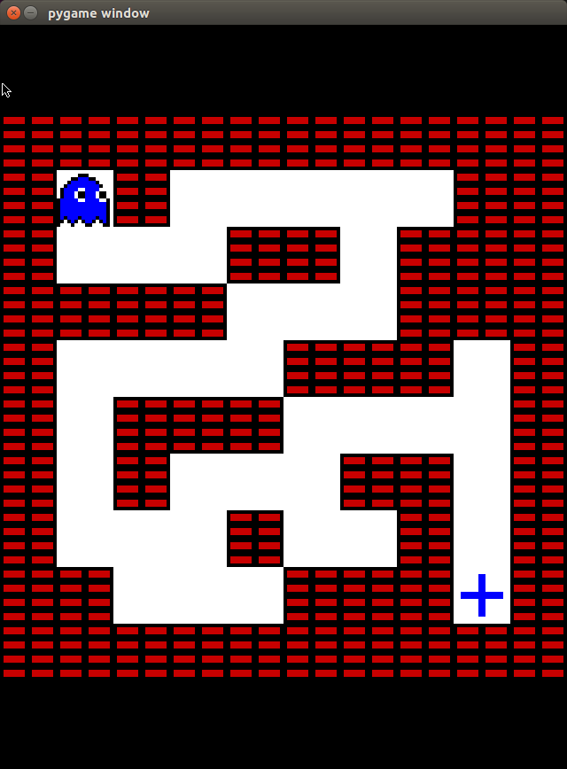

# gym-maze
A simple maze game (with atari rendering) in the gym OpenAI environment

<p align="center">
  
</p>

## Installation instructions
----------------------------

Requirements: gym with atari dependency

```shell
git clone https://github.com/meagmohit/gym-catch
cd gym-maze
python setup.py install
```

```python
import gym
import gym_maze
env = gym.make('maze-v0')
env.render()
```

## Environment Details
----------------------

* **maze-v0 :** Default settings (`grid_size=(10,10)`)
* **MazeNoFrameskip-v3 :** Default settings (`grid_size=(10,10)`) and `tcp_tagging=True`

## Agent Details
----------------

* `agents/random_agent.py` random agent plays game with given error probability to take actions (Perr).
* `agents/play.py` for humans to play the game. Keys w,s,a,d for UP, Down, Left and Right respectively.
* `agents/agent_recordEEG_openLoop.py`  plays the game slow with TCP connection port to allow data stimulation recording

## References
-------------
